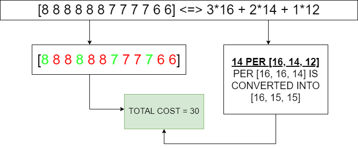
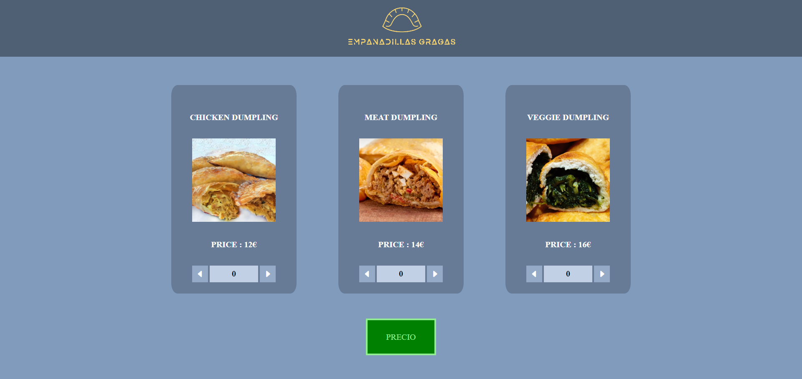

<h1 align="center">
  <br>
  <a href="http://www.amitmerchant.com/electron-markdownify"></a>
  <br>
  JS Problem - Dumpling buy
  <br>
</h1>

## Stack 🛠️
<div align="center">
<a href="https://developer.mozilla.org/es/docs/Web/JavaScript">
    
</a>
 </div>

## Problem to solve 🤔

A teacher is on the task to get dumplings to all programming bootcamp assistants, being today the Dumpling's Day. By that reason, there is a special offer which gives you 3 dumplings by the cost of the most expensive one. With a tight budget, the teachers think trying to minimize the total cost for all the dumplings.

After thinking, a teacher decides to follow the next strategy: knowing the fact that is going to buy the most expensive one no matter what, he will buy it with the second and the third most expensive ones, to get the most amount of saved money. With n-3 dumplings left, he will follow the same criteria till the end.

The teachers think and arrive to the conclusion that is the best strategy. But, before paying, they listen a near family conversation:

"We want one chicken dumpling for 12 euros, one meat for 14 euros and one veggie for 16 euros".

The teachers thinks inmediately: "They will get the 3x1 offer, they only pay the 16 euros from the veggie dumpling and the chicken and meat ones they will taken it free". The family continue:

"But take it as follows: 2 half chicken and half veggies dumplings, and the meat one apart. As all dumplings cost 14, we will take the 3x1 offer and we take all by the cost of 14 euros".

After being shocked, the teachers decide to use the fact that you can order half one type and half another type dumplings, paying the average cost of two entire dumplings. So, one dumpling half chicken and half veggie will cost (12+16)/2 = 14 euros. Nevertheless, they can't determine which is the best way to arrange the dumplings in halfs first, and then in groups, to minimize the price.

Help them making a function to calculate as fast as posible: there are tons of hungry students in your hands.

The dumplings selected by the teachers have 3, 4 or 5 ingredients. The mass costs 6 euros, and each additional ingredient costs 2 euros. So, the dumplings can cost 12, 14 or 16 euros. Is sure the total number of dumplings is divisible by 3.


## Explanation first algorithm develop 👾
On this section, I'm going to explain the logic behind the programming of the function fn, called to ask about the minimum price for a certain amount of dumplings of each type.

<h3>The beggining - Error scenario prevention</h3>
At the beggining of the function, there are 3 checks of the amount of dumplings given as parameters of the function:

```javascript

if(empanadasPollo < 0 || empanadasTernera < 0 || empanadasVerdura < 0){
      throw new Error("Hay alguna empanada menor a cero, y eso es imposible");
   }

   if((empanadasPollo + empanadasTernera + empanadasVerdura) % 3 != 0){
      throw new Error("El numero de empanadas no es multiplo de 3, por lo que no se aprovecha la oferta del 3x1");
   }

   if(empanadasPollo + empanadasTernera + empanadasVerdura >= 40){
      throw new Error("El numero de empanadas pedido excede el de produccion");
   }

```

As you can see, there are 3 if statements, each one to prevent 3 not desired scenarios of inputs done by the user. The first one, is to deny the input of a negative amout of dumplings, throwing an error. The second one, is when the input total number of dumplings is not equal to a multiple of three, throwing another error. Lastly, is checked if the total amount of dumplings is greater than 39, maximum amount of dumplings per order, throwing an error.

<h3>Original approach to the problem : Assuming best scenario and checking last possibles scenarios</h3>

After checking the correct input values given to the function, I approached the problem using an interesting data from the problem: When you have one of each type of dumpling, the minimum price is the middle one. Taking that, is done the following code:

```javascript

   let totalCosto = 0;
   const precioPollo = 12;
   const precioTernera = 14;
   const precioVerdura = 16;

   while(empanadasPollo > 0 && empanadasTernera > 0 && empanadasVerdura > 0){
      totalCosto = totalCosto + 14;
      empanadasPollo--;
      empanadasTernera--;
      empanadasVerdura--;
   }

```

On this part, I have instantiated 4 variables, representing the total amount of money and the price of each type of dumpling. After that, I made a while loop until one type of dumpling is zero, and during that, I add to the total amount of cost the 14 middle price and I remove 1 of each type of dumpling, saving as much money as I can.

After this loop, I reached a scenario in which one there are no more dumplings or there are not from 1 or 2 types of dumpling. So, knowing this fact, if there are no more dumplings, is the best price calculated; and on the other 2 I have studied all the possible cases using the following formula:

$({(a+b)*13 \over 2} + {(b+c)*15 \over 2} + {(a+c)*14 \over 2})$

Thanks to this formula, where a, b and c is equal to 1 or 0 if, after the previous calculation, there are chicken, meat or veggie dumplings remaining respectively. With that, are calculated the different minimum prices that are put on the following case scenarios:

<h4>1. No chicken or meat dumplings</h4>

```javascript

if(!hayPollo && !hayTernera){
      while(empanadasVerdura > 0){
         totalCosto = totalCosto + precioVerdura;
         empanadasVerdura = empanadasVerdura - 3;
      }
   }

```

On this scenario, the unique approach is to set groups of 3 of the veggies dumplings, adding to the cost the value of one of them.

<h4>2. No chicken or veggie dumplings</h4>

```javascript

if(!hayVerdura && !hayPollo){
      while(empanadasTernera > 0){
         totalCosto = totalCosto + precioTernera;
         empanadasTernera = empanadasTernera - 3;
      }
   }

```

On this scenario, the unique approach is to set groups of 3 of the meat dumplings, adding to the cost the value of one of them.

<h4>3. No meat or veggie dumplings</h4>

```javascript

if(!hayVerdura && !hayTernera){
      while(empanadasPollo > 0){
         totalCosto = totalCosto + precioPollo;
         empanadasPollo = empanadasPollo - 3;
      }
   }

```

On this scenario, the unique approach is to set groups of 3 of the chicken dumplings, adding to the cost the value of one of them.

<h4>4. No chicken or meat or veggie dumplings</h4>

```javascript

if(!hayPollo){
      while(empanadasTernera > 0 && empanadasVerdura > 0){
         if(empanadasTernera < empanadasVerdura){
            totalCosto = totalCosto + precioVerdura;
            empanadasTernera = empanadasTernera - 1;
            empanadasVerdura = empanadasVerdura - 2;
         } else if (empanadasTernera > empanadasVerdura){
            totalCosto = totalCosto + (precioVerdura + precioTernera)/2;
            empanadasTernera = empanadasTernera - 2;
            empanadasVerdura = empanadasVerdura - 1;
         } else {
            totalCosto = totalCosto + precioVerdura + precioTernera;
            empanadasVerdura = empanadasVerdura - 3;
            empanadasTernera = empanadasTernera - 3;
         }
      }
   }

```

On this scenario, is tested all the combinations between the meat and veggies dumplings remaining without chicken, where: if there are more veggies dumplings, the cost is the price of one of them, sibstracting 2 of veggies and one of meat; if there are more meat dumplings, the cost is the price of half meat half veggie, sibstracting 2 of meat and one of veggies; and if there are the same, where the best is to group by type, adding the cost of one group of 3 veggie dumplings and one group of meat dumplings. For the other 2 case scenarios, follows the same logic as this one, changing the dumplings that are involved in.

Finally, after all the check case scenario, is returned the minimum total amount for all the dumplings.

## Explanation most efficient way algorithm 🤖

The best solution taking account the code implementation, is to notice one thing: no matter the number of each dumpling, in all scenarios the average price will be the same, so making the sum of all the costs splitted by the 3 (3x1 offer) is the minimum price rounded up to odd prices. The implementation will be as follows:

```javascript

let totalCosto = Math.ceil((empanadasPollo * precioPollo + empanadasTernera * precioTernera + empanadasVerdura * precioVerdura) / 3);

```

## Explanation interesting algorithm

Trying to approach a better solution that the first one that I have implemented, I noticed an interesting property of the problem. If you try to think a way to demostrate, using the half parts costs of the dumplings, the best combination possible of that halfs will be determined by arranging them in order in an array and making groups of three applicating that order. There is only ONE exception to that rule, and is when there are the same amount of all the types of dumplings, in that cases the best solution is to do the sum of costs explained on the previous section. Here is an example:



As you can see, the example consists on 3 veggies, 2 meat and 1 chicken dumpling, where you can buy it entirely or in halfs. Entire dumplings will work as is shown on the right, where applying the 1-1-1 case, the best price is 14, and after that, the max price for 0-1-2 dumplings is 16; being the sum equal to 30. Mid dumplings will work as is shown on left, where the list arranged of the halfs, taking the first of 3 group of halfs is equal to 30 too. This part is implemented as follows:

```javascript

const precioPollo = 12;
const precioTernera = 14;
const precioVerdura = 16;
let totalCosto = 0;

let arrayEmpanadasPollo = new Array(empanadasPollo*2).fill(precioPollo/2);
let arrayEmpanadasTernera = new Array(empanadasTernera*2).fill(precioTernera/2);
let arrayEmpanadasVerduras = new Array(empanadasVerdura*2).fill(precioVerdura/2);

let arrayVerduraTernera = arrayEmpanadasVerduras.concat(arrayEmpanadasTernera);
let arrayEmpanadasPedidas = arrayVerduraTernera.concat(arrayEmpanadasPollo);

if(arrayEmpanadasPollo.length == arrayEmpanadasTernera.length && arrayEmpanadasPollo.length == arrayEmpanadasVerduras.length){
    totalCosto = precioTernera * empanadasTernera;
} else {
    for(let i = 0; i < arrayEmpanadasPedidas.length; i += 3){
        totalCosto += arrayEmpanadasPedidas[i];
    }
}
   
return totalCosto;

```

Here, firstly is created the list of halfs and then all lists are concatenated to get the one shown on the diagram, and if is not the n-n-n scenario, loops through the list and gets the 0, 3, 6... positions to sum them.

After some testing with large numbers inputs, I detected some cases in which this approach is not accurate enough to get the result (some small differences like 1 or 2).

## Final decision and conclusion 🎯

After comparing all the three ways to solve the problem, I decided to stay with the original approach, because the Math.Ceil() function has some resolution problems in different cases (not the ones that appears on the main.test.js); and the halfs approach with larger amounts of dumplings (like 13,10,13) cannot reach the exact amount expected. By that reasons, I stay with the original approach, with the only problem that is a lot of code in front of the other options.

## Use instructions - Tests :computer:

1. Clone repo
2. Install dependencies:

    ```bash
    npm install
    ```

3. Execute tests:
    ```bash
    npm run test
    ```

## Use instructions - Web 🖥️

1. Clone repo
2. Change function fn to be able to being used in JS as follows:

```javascript
    // originalAlgorithm.js : Remove export from this line:
    export const fn = (empanadasPollo, empanadasTernera, empanadasVerdura) => {
    // ...
    };
```
3. Launch index.html, the interface will show you a 3 dumpling selector, the result is shown on console :D



## Support

<div align="center">
<a href="https://www.youtube.com/watch?v=dQw4w9WgXcQ&ab_channel=RickAstley" target="_blank"></a>
</div>

## You may also like...

- [Between Sins](https://gitlab.com/daghdha1/betweensins) - RPG videogame 
- [Mars Alienated](https://gitlab.com/AdrianGarciaAndreu/mars-alienated-rv-htc) - VR escape room experience in a space station

<div align="center">
<a href="https://www.linkedin.com/in/carlos-ibañez-lamas-74487b228/" target="_blank"></a>
<a href="https://gitlab.com/CariblaGTI" target="_blank"></a>
</div>